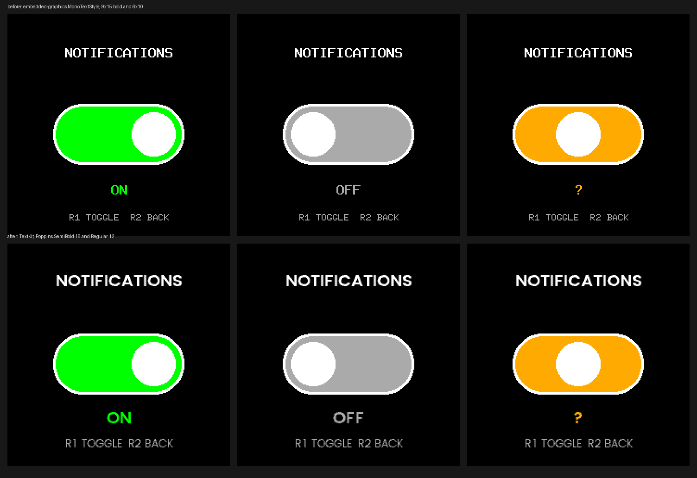

# Notify — turn phone notifications on or off, on the watch

The launcher name is `Notify`; the directory, the binary and the CMake
`APP_NAME` stay `NotifyToggle`. `Notify Toggle` was tried and clipped on the
watch's app list.

A utility app that does one thing: show a single centered switch, and let R1
flip it — immediately, and durably. There is no second screen, no
configuration to type in, and nothing else on the display. Built the way
[RustGuiPoc](../RustGuiPoc), [QrGuiPoc](../QrGuiPoc) and [Spin](../Spin) are —
a C++ `Gui.cpp` that owns the kernel message loop and framebuffer, and a Rust
core (`embedded-graphics`, no TouchGFX) that owns only pixels, over a checked
C ABI.

## What it actually toggles

Not a per-app capability, and not a copy of the setting — the real,
watch-wide `phone.notifications` flag inside `2:/settings.json`, the same
file the paired UNA phone app edits. Two things had to be reverse-engineered
on this exact watch unit (kernel 1.4.0) to make that possible at all; the
full derivation, address by address, lives in
[`Docs/Investigations/2026-08-31-live-settings-persistence/`](Docs/Investigations/2026-08-31-live-settings-persistence)
and, canonically kept current, in `una-sdk`'s `research` branch. Short
version:

- **No app-facing message can read or write this setting.** The SDK hands an
  app watch settings through exactly one message, `RequestSystemSettings`
  (`Libs/Header/SDK/Messages/CommandMessages.hpp`), whose payload carries
  language, units, time format, heart-rate zones, daily goals, height and
  weight — the whole `phone` group is absent. That omission is deliberate
  rather than an oversight: the simulator's `REQUEST_SYSTEM_SETTINGS` handler
  (`Libs/Source/Simulator/App/KernelMessageDispatcher.cpp`) copies
  `unitsImperial`, the zones and the three daily goals out of the very
  `WatchSettings` struct that holds `phone.notifications`, and steps over that
  one field. Nor is there a setter anywhere: `REQUEST_SYSTEM_INFO` and
  `REQUEST_SYSTEM_SETTINGS` are the only two `REQUEST_SYSTEM_*` messages in the
  headers, and both are reads. The single notification lever an app is given is
  `RequestSetCapabilities::enPhoneNotification`, which the SDK's own comment
  scopes as "Enable phone notifications during app" — it lasts only as long as
  the declaring app, which is why it is not what R1 pulls here. Falsified by a
  `phone` field appearing in `RequestSystemSettings`, a third
  `REQUEST_SYSTEM_*` message, or that handler learning to copy the field.
- **The SDK's own sandboxed filesystem API cannot reach `settings.json` at
  all.** `FileSystemGuard::getFullPath` implements exactly one relative-path
  escape (a hardcoded match on `"../SharedData"`) and rejects every other
  `..` path outright — confirmed both by disassembly and by testing every
  spelling of a two-`..` path on the device. An earlier `SettingsFile.cpp`/
  `SettingsPatch.cpp` attempt at that route proved this conclusively; it's
  gone from this tree now (git history and
  [`Docs/Investigations/2026-08-31-live-settings-persistence/`](Docs/Investigations/2026-08-31-live-settings-persistence)
  have the record), and `Gui.cpp` never called it for the live toggle logic.
- **This hardware has no memory isolation for apps** (no MPU, apps run
  privileged, no TrustZone — confirmed from the watch's own boot-time
  register state). A running app can read and write arbitrary memory,
  including the kernel's own live settings struct, with a plain pointer.
  `LiveSettings.cpp` uses that to read/write the live, in-RAM copy of
  `phone.notifications` directly — immediate effect, the moment R1 is
  pressed.
- **Persisting that change to flash** does not go through the settings
  class's own `save()` method: it has zero callers anywhere in the firmware,
  and the real phone app doesn't call it either — it overwrites the whole
  file over Bluetooth. `SettingsPersist.cpp` instead calls the kernel's
  internal, non-virtual `File` class directly to read the real file, splice
  in only `phone.notifications`, and write it back, then re-reads to confirm.
- **The commit moves the previous file aside and puts it back if anything
  goes wrong.** FatFs will not rename onto a name that already exists, so the
  order is: write `2:/settings.json.tmp`, move the current file to
  `2:/settings.json.ntprev`, rename `.tmp` into place, then drop the scratch
  copy. If the second rename fails, the previous file is moved straight back,
  so the failure mode is "nothing changed", not "no settings file". The
  firmware's own `settings.json.bak` is never touched — the firmware
  maintains that one itself, and spending the wearer's only firmware-made
  backup on this app's convenience is not this app's call to make. The
  firmware's own atomic-write functions (`0x0806dd54`/`0x0806de64`) turned
  out to be tightly coupled to the live Settings object's internal state
  rather than a portable primitive, so the general-purpose
  `exists`/`delete`/`rename` kernel utilities underneath them (55/41/21 real
  callers across the firmware image) are used directly instead.

**What a watch has actually run.** On 2026-09-05, on the author's unit: the
firmware gate accepted, the live read/write worked, and three toggles were
written to `2:/settings.json` and verified by readback. Turning the flag on and
off again returned the file to a byte-identical state (content hash
`0xAAD0F819` ↔ `0x18A1F0DE` and back), every field this app does not own was
preserved exactly, and the firmware's own `settings.json.bak` was untouched
throughout. **The setting then survived a full power cycle** — the kernel
reloads the written file at boot, which is the whole point of the file write
existing. Falsified by a run where the flag reads back differently after a
reboot. Treat the address table as what it is: one watch, one firmware.

Everything above is specific to one unit's kernel — addresses that would need
re-deriving, not assuming, on another watch or firmware version. This app never
assumes it either. `Software/Libs/Header/FirmwareGate.hpp` decides, in three
steps, and refuses outright at any of them:

1. **The kernel's ABI.** `gIKernel->version`, the version the loader patched in
   — the only account of itself this kernel gives a running app.
   `RequestSystemInfo` is declared in the SDK headers and answered `FAIL` by
   kernel 1.4.0; `RequestSystemSettings` succeeds in the same run, so it is
   that message and not the mechanism. The manifest's `minKernelVersion` is no
   substitute: it is a floor the phone checks at install time, not something
   the app can read.
2. **The bytes at each address, read but never called.** An ABI is shared by
   every firmware version that ships it (`abi_kernel_map.json` maps one to the
   *minimum* firmware providing it), so the row an ABI selects is a candidate,
   not a verdict. Each row carries 16 bytes recorded from the firmware it was
   derived against, and they are compared before a single one of those
   addresses executes — because on a part with no MPU a wrong address does not
   return an error, it runs. A `static_assert` checks each signature is filed
   under the address it fingerprints, so the two tables cannot drift apart.
3. **The File primitives, proved rather than assumed** — but only when saving
   is switched on, since that is the only mode that uses them for writing.
   `SettingsPersist::validatePrimitives` exercises them against this app's own
   scratch paths: a path written through `setPath` and read back out of the
   object, a file of known length whose size field reads back, a content
   round-trip, rename and delete answering differently for present and absent
   files.
4. **The live struct, against the file.** The `notifications` byte and
   `watchFaceId` read through the raw pointer must both match what
   `2:/settings.json` says. Two independent sources agreeing is the evidence
   that the struct base is the settings struct; a range check on one field is
   not, because zeroed memory passes it.

With saving off — the default — steps 3 and 4 collapse into one: reading
`settings.json` exercises every primitive that mode ever calls, and the
cross-check is what says it worked. Nothing is written to the watch at all.

Only one row per ABI is possible, and a `static_assert` enforces it: nothing
this app can read at runtime tells two same-ABI firmware versions apart, so a
second row could never be selected. Supporting that would need byte signatures
at each address, which this app deliberately does not carry.

## Screen and buttons

One screen: the word `NOTIFICATIONS`, a pill switch (green and right when on,
grey and left when off), the current state as text, and a button hint.

The screen has to be able to say four different things, because a switch that
only ever moves cannot tell them apart:

| What happened | What it draws |
|---|---|
| Read and saved | Green/grey pill, `ON` or `OFF` |
| Live value could not be read | Amber pill, knob centred, `?` |
| Flipped, but the file was not written | Amber pill, knob on the live side, `NOT SAVED`, footer `REVERTS ON REBOOT` |
| Saving is switched off (the default) | Ordinary green/grey pill and `ON`/`OFF`, footer `REVERTS ON REBOOT` |
| The firmware gate refused | No pill at all, `UNSUPPORTED`, footer `NEEDS WATCH 1.4.0` |

The last two are the ones that matter. A change that took effect live but never
reached `settings.json` is real right now and gone at the next reboot, and it
used to draw exactly the same confident green as one that saved — the renderer
test `not_saved_is_visually_distinct_from_a_saved_on` is what holds that line.
An unsupported firmware draws no switch, because R1 cannot move one.

The words are Poppins SemiBold 18 and the hint Poppins Regular 12, drawn from
[`TextKit`](../TextKit)'s pre-rendered atlases rather than
`embedded-graphics`' fixed-width bitmap fonts. Before and after, through the
bezel mask the watch applies:



The hint sits two rows higher than it did: at Regular 12 it is 117 px wide,
and the lit chord is 122 px at row 222 against 129 at row 220. The bezel test
in the crate is what found that, not a wrist.

| Button | Does |
|---|---|
| R1 (`SW2`) | Toggle. Flips the live value, writes it to `settings.json`, and re-reads to confirm. Does nothing on an unsupported firmware. |
| R2 (`SW4`) | Back — exits the app. |

Unlike a capability scoped to "while this app runs," closing the app changes
nothing: the watch-wide flag stays where R1 left it. Whether it also survives a
reboot depends on the write having succeeded, which is why the screen says so
either way.

## Building

Targets **`apps-v1.4.0`**, the same as RustGuiPoc, QrGuiPoc and Spin.

```sh
rustup target add thumbv8m.main-none-eabihf
export UNA_SDK=/path/to/una-sdk
cd Software/Apps/NotifyToggle-CMake
cmake -B build -G "Unix Makefiles" -DBUILD_VERSION=0.1.0 .
cmake --build build
```

The `.uapp` lands in `Output/`; deploy it per the SDK's `Docs/deploy.md`.

`-DNOTIFY_TOGGLE_DEBUG_LOG=ON` adds diagnostic logging to a file in the app's
own directory on the watch. It is off by default and belongs off in anything a
wearer installs; it never logs file contents, because `settings.json` holds
height, weight, gender and date of birth.

### Footprint

From real builds against `apps-v1.4.0` in CI's toolchain image (linker map
section headers, 600 KiB GUI RAM window, code executing from RAM):

```
GUI      .text 47,780   .data 540   .bss 58,528   .stack 10,240   .uapp 55,996
Service  .text  2,180   .data  36   .bss    556   .stack 10,240
```

`SDK::AppConfig` and the JSON reader it needs are 17.5 KB of that GUI `.text`,
for one declared boolean — the price of the setting being something the
companion app can present and explain rather than a build-time constant.

`.bss` is mostly the 57,600-byte framebuffer, as on every CustomGUI app in
this repo. There's no `SDK::AppConfig`/JSON dependency linked in at all —
this app never reads or writes an app-scoped config file of its own, only the
kernel's real settings struct and the real `settings.json`, both via raw
pointers and a hand-derived internal `File` class. Re-derive the numbers with
`arm-none-eabi-size -A` rather than trusting this table.

## Why persistence lives in the GUI process

Reading, drawing, flipping and writing the toggle are all GUI-side, because R1
is a GUI-side event and there's no reason to hop to the Service process and
back for a change that finishes in microseconds.
`Software/Libs/Sources/Service.cpp` is a stub that exists because the SDK's
entry point requires both halves; it is not linked against `LiveSettings` or
`SettingsPersist` at all, so no raw address reaches a binary with no use for
one.

## Tests

The splice — the part that decides which bytes of a real personal settings file
get rewritten — is a header-only module with no SDK types, so it runs at a desk:

```sh
cmake -B build -S Tests && cmake --build build && ctest --test-dir build
```

Those cases are the file read off a real watch, a `notifications` key belonging
to something other than `phone`, whitespace, braces inside string values,
truncated JSON, and the one-byte growth from `true` to `false` against a full
buffer. What they cannot cover is everything above them: the addresses, the
`File` primitives and the commit rename only ever run on a watch.

```sh
cd Software/Apps/CustomGUI/rust
cargo test --features std
```

`knob_moves_side_with_state` and `pill_fill_reflects_state` are the ones
worth reading first: they sample specific pixels rather than diffing whole
frames, so each one states the one thing that has to be true of this screen
— the knob is on the side the state says, and the fill colour matches it —
rather than merely asserting that toggling `enabled` changes *something*.

The C++ half type-checks on a host without the ARM toolchain, which catches
renames across the ABI:

```sh
clang++ -std=c++17 -fsyntax-only -Wall -I"$UNA_SDK/Libs/Header" \
  -ISoftware/Libs/Header -ISoftware/Apps/CustomGUI \
  Software/Apps/CustomGUI/Gui.cpp Software/Libs/Sources/Service.cpp \
  Software/Libs/Sources/SettingsAddresses.cpp Software/Libs/Sources/LiveSettings.cpp \
  Software/Libs/Sources/SettingsPersist.cpp Software/Libs/Sources/DebugLog.cpp
```

`app-manifest.json` is checked the same way every other app's is:

```sh
python3 $UNA_SDK/Utilities/Scripts/app_packer/validate_app_config.py \
    --check app-manifest.json
```

## Desktop simulator

```sh
brew install sdl2   # or the Linux equivalent
cd Software/Apps/CustomGUI/rust
cargo run --bin sim --features sim
```

`SPACE` or `ENTER` toggles (matching R1), `ESC` or `BACKSPACE` quits (matching
R2). `U`, `N` and `F` preview the unreadable, not-saved and unsupported screens,
which a wrist only reaches by something going wrong. It calls the same
`notify_toggle_gui::render()` the firmware calls, into an identical buffer, so
the framebuffer matches the device's by construction.
