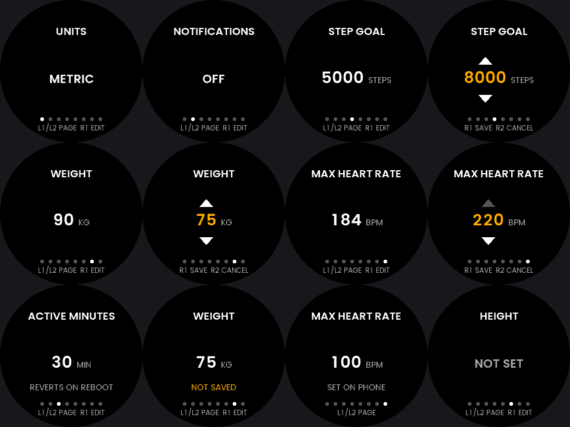

# Settings — edit the watch's own settings, on the watch

**Status: a design record and two settled parts, not a shipping app.** The
renderer and the editor state machine are built and tested; the generalised
splice is built and tested against real files pulled off a watch. There is no
C++ shell, no CMake target, no manifest and no assigned app id. [What to build
next](#build-order) says what is left and in what order, and
[what could not be measured](#the-measurements-this-could-not-take) says what is
waiting on a wrist.

The launcher name would be `Settings`; the directory, the binary and the CMake
`APP_NAME` stay `SettingsEditor`, following
[`NotifyToggle`](../NotifyToggle) and [`UnitToggle`](../UnitToggle).

One app, one setting per screen, over the same mechanism those two use:
[`SettingsKit`](../SettingsKit) for the firmware gate, the live struct and the
commit, and a Rust core that owns only pixels and the editor's own state.



---

## 1. What it edits, and what it refuses

`2:/settings.json` holds twelve fields. **Eight are editable here. Four are
refused, and the refusals are the design.**

The right-hand column is the argument for the whole thing: seven of the twelve
appear in `SDK::Message::RequestSystemSettings`, a supported message this watch
answers. Writing a field the kernel then reports back is a **second,
independent** confirmation that the byte written was the field intended —
something `NotifyToggle` has never had for `phone.notifications` and cannot get.

| Field | In the file | Live struct | Reported by the kernel | Editable | Witness seen on a watch |
|---|---|---|---|---|---|
| `units` | `"metric"`/`"imperial"` | `+0x04` u8 | `imperialUnits` | **yes** | yes, 2026-09-07 |
| `phone.notifications` | nested bool | `+0x05` u8 | no | **yes** | never — nothing reports it |
| `dailyGoals.activityMinutes` | int | `+0x18` u32 | `activityMin` | **yes** | yes, gate cross-check 30/30 |
| `dailyGoals.steps` | int | `+0x1c` u32 | `steps` | **yes** | yes, gate cross-check 5000/5000 |
| `dailyGoals.floors` | int | `+0x20` u32 | `floors` | **yes** | **not yet** |
| `height` | int, cm | `+0x24` u32 | `heightCm` | **yes** | **not yet** |
| `weight` | int, kg | `+0x28` **f32** | `weightKg` | **yes** | yes — Spin logged `weight=90` beside a file saying `90` |
| `heartRateZones` | 6 ints | `+0x10..+0x15` u8[6] | `heartRateTh[]` | **yes**, as one number | yes — `max_hr` tracked the file at 184 and at 100 |
| `watchFaceId` | int | `+0x08..+0x0F` **u64** | no | **no** | — |
| `gender` | `"M"` | **nowhere** | no | **no** | — |
| `dateOfBirth` | `"1990-01-01"` | **nowhere** | no | **no** | — |
| `version` | int, `2` | `+0x00`, then discarded | no | **no** | — |

Every offset and width in that table was re-derived this session from the
firmware's own settings **parser**, which names each key it stores — the method
[`SettingsKit/Docs/2026-09-06-units-offset.md`](../SettingsKit/Docs/2026-09-06-units-offset.md)
introduced for one field, run over the whole function. The full derivation is
[`2026-09-07-live-settings-struct.md`](../SettingsKit/Docs/2026-09-07-live-settings-struct.md).
Three things in the prompt's own field census turn out to be wrong, and all three
are settled from the image rather than from a wrist:

- **`height` at `+0x24` was `UNVERIFIED`.** The parser names it: `add.w r2, r4,
  #36` beside `ldr r1, -> "height"`. `save()` names the same offset under the
  same string. Confirmed, twice.
- **`heartRateZones` was `CONTRADICTORY`.** The constructor's "4-byte
  pointer-shaped literal" at `+0x10` is not a pointer — it is `0x9885725F`,
  followed by a `strh` of `0xBEAB`, which is the six bytes **95, 114, 133, 152,
  171, 190**: exactly 50/60/70/80/90/100% of 190. Four sources now agree, and
  §3 below is why that one fact settles the whole heart-rate interface.
- **`watchFaceId` is 64-bit, not 32.** The parser calls `strtoull` and stores
  eight bytes. So `LiveSettings::readChecked` reading `+0x08..+0x0F` as a `u64`
  is a plain range check on one field, not — as the prompt reads it — an
  incidental assertion that `+0x0C..+0x0F` are zero. Nothing else lives there.

### Why each refusal

**`watchFaceId`: read-only, and not even displayed.** Three reasons, any one of
which would do. It is the field `LiveSettings::readChecked` cross-checks *every*
unwitnessed raw read against, so an app that could write it could invalidate its
own gate — write 5,000 and the next read of `phone.notifications` refuses. No
supported message reports it, so there is no witness. And no bound tighter than
"plausibly small" exists: the set of valid face ids is whatever faces are
installed, which an app cannot enumerate. It is not displayed either, because
`watchFaceId 0` is a number a wearer cannot map to a face, and the watch's own
face picker already does this job properly.

*Falsified by* a message that reports the installed faces, or a face id the app
could name.

**`gender` and `dateOfBirth`: out of scope, not merely read-only.** The strings
`gender` and `dateOfBirth` **do not appear anywhere in the 4 MB firmware image**
— not as parser keys, not in `save()`'s literal pool, not at all. The parser
returns two instructions after `weight`. So nothing on kernel 1.4.0 reads either
field, and a wrist edit would change no watch behaviour whatsoever: it would
write two strings into a file for the phone app's benefit and nothing else.

That also disposes of the prompt's worry that "the live struct disagrees with the
file until the next reboot" — there is no live copy of these two to disagree. The
real risk points the other way: if `save()` ever ran it would **delete** both
keys, since it emits neither. That would happen whether or not this app existed.

`dateOfBirth`'s only known purpose is the age-derived default maximum heart rate
— and §3 makes that number directly editable, which is strictly better than
editing the birthday it is inferred from.

*Falsified by* either string appearing in a firmware image, or a supported
message carrying either.

**`version`: out of scope.** It is the file's schema version. The parser reads
the file's value into a stack slot, **discards it**, and stores the constant `2`;
`save()` also emits a constant `2`. It is not a setting in any sense.

---

## 2. The value type, and what replaced the `0/1` check

### 2.1 The most important decision is not a UI decision

`LiveSettings.cpp` refuses a `phone.notifications` byte that is not 0 or 1. That
check is easy to misread as bounds-checking a value. It is not: it is the only
evidence the app has that **the address is the field it thinks it is**. Widening
the value type deletes it, and the prompt is right that whatever replaces it is
the whole ballgame.

**What replaces it is not a wider bound. It is equality against the kernel's own
report.**

For the seven fields `RequestSystemSettings` carries, the app can read the raw
field *and* ask the kernel for the same field, before writing anything, and
refuse unless they are equal. That is not a loosening of the 0/1 check — it is
enormously tighter. A range admits every value in it; equality against an
independent source admits exactly one. `UnitToggle::rawAgreesWithKernel` already
does this for `units` and it is the shape that generalises:

| | before the write | after the write |
|---|---|---|
| witnessed field | raw read **equals** the kernel's report, or refuse | the report **follows** the write, or revert |
| `phone.notifications` | raw is 0 or 1, or refuse — **unchanged** | the byte reads back, as today |

So the widening costs nothing in safety for seven fields and gains a second
line of defence for six of them that never had one. The one field with no
witness keeps exactly the check it has, because it is still a boolean —
`TheOnlyUnwitnessedWritableFieldIsStillABoolean` is that claim as a host test,
and it will fail the moment anyone adds a wider unwitnessed field.

*Falsified by* a watch where a witnessed field's raw read and reported value
disagree while both are correct — which would mean the message and the struct
are different copies rather than two routes to one.

### 2.2 Write bounds are a separate question, and a weaker one

§6.7 asks whether a write needs a bound the read does not. It does, and it is a
different kind of thing: a guard on **what a wearer could have meant**, not on
what the struct should be holding. It belongs in the stepper's range, where an
out-of-range value is unreachable rather than refused.

`SettingsKit/Header/EditableFields.hpp` carries the ranges. Two of them are
derived; the rest are asserted, and the document says which:

| Field | Range offered | Where it comes from |
|---|---|---|
| `units`, `phone.notifications` | 0–1 | **derived** — the parser knows two spellings and its boolean reader refuses anything above 1 |
| max heart rate | 90–220 bpm | **partly derived**: ≤ 255 because the live field is six `u8`; ≥ 10 because the ladder's gap is a tenth of the maximum and two equal floors are a zone nothing can be in. 90–220 is the physiological narrowing and is **asserted** |
| `activityMinutes` | 5–240 min | ≤ 1440 is derived (a day). 240 is **asserted** |
| `steps` | 500–50,000 | **asserted** |
| `floors` | 1–200 | **asserted** |
| `height` | 100–250 cm | **asserted** |
| `weight` | 25–250 kg | **asserted** |

`EveryOfferedRangeSitsInsideTheHardBoundForItsField` tests the derived halves.
The asserted ones are asserted, and **the experiment that would settle them is
one session with the phone app**: try to enter a goal of 0, of 1,000,000, a
height of 10 cm, a weight of 500 kg, and pull the file each time. The phone app's
own limits are the right answer, because they are what a wearer's other client
already enforces, and a wrist app that refuses what the phone accepts is a bug.

The reason the asserted bounds are tolerable in the meantime is that they are
**not the safety mechanism** — §2.1 is. They only stop a wearer scrolling to a
number nobody meant.

### 2.3 What the value type actually is

Not a tagged union, not a `void *`, not parallel tables per type.

**The splice never sees a typed value at all.** It sees a JSON token — bytes and
a length — and the shape the old token must have:

```cpp
SettingsSplice::Result replaceValue(char *buf, size_t &len, size_t capacity,
                                    const KeyPath &key, JsonShape shape,
                                    const char *newToken, size_t newTokenLen,
                                    size_t *valueOffsetOut);
```

`JsonShape` is `Boolean`, `UnitsToken`, `Number` or `NumberArray6`. Formatting a
value into a token is a separate, per-type, host-testable function. Everything
else — the depth-scoped key search, the token validation, the tail move, the
read cap — is written once.

Why this and not the alternatives, costed:

- **A tagged union** would have to carry an `f32` for `weight`, so the splice
  would need float-to-decimal formatting with no `snprintf` and no allocation —
  real code, real rounding decisions, for one field. Under the token design the
  *formatter* owns that, and §4 decides `weight` is edited in whole kilograms,
  so no float formatting is written at all. The union's tag is also one more
  thing that can disagree with the field's real type; a shape is the validator
  rather than a label, so there is nothing to desynchronise.
- **`void *` plus a type tag** deletes every compile-time check. No.
- **Parallel monomorphic tables per type** keeps the compiler checking, but the
  navigation and editor code has to switch on which table a field is in anyway,
  so the tag moves into the table's identity and the plumbing multiplies by
  four. Twelve rows across four tables is worse than twelve rows in one.

The prompt's observation that a field needs **two type tags** is right, and this
design puts them in different structs so they cannot be confused. `JsonShape`
lives on the file side; `LiveWidth` (`U8`, `U32`, `U64`, `F32`, `U8x6`) lives on
the raw side. `weight` is `Number` + `F32`. They meet only in
`widthCanHoldShape`, a `constexpr` predicate that refuses the combinations no
field could have — a `Boolean` behind a four-byte read, a six-value array behind
a one-byte one.

### 2.4 `Field` is split, and the two shipped apps did not change

`SettingsPersist::Field` conflated the field descriptor with the app's scratch
identity. It is now three things:

- **`FieldDescriptor`** — one per field: name, `KeyPath`, `JsonShape`,
  `LiveWidth`, `Witness`, the write range, and the live offset as a
  **pointer-to-member of `AddressSet`** rather than a number. That last part
  matters: a plain offset in a descriptor would be a per-firmware value frozen at
  compile time, which is the exact mistake `SettingsAddresses` exists to prevent.
- **`AppIdentity`** — one per app: the two probe paths and the probe text.
  `validatePrimitives` proves the kernel's `File` primitives behave, which is a
  property of the firmware and of nothing a field says, so it was never
  per-field.
- **`Field`** — kept exactly as it was, for the two single-field apps that
  declare one. Its `isWellFormed` now delegates to `AppIdentity`'s, so there is
  one implementation of the path checks rather than two.

`NotifyToggle` and `UnitToggle` compile against the changed kit **with no edits
at all** — checked with `-fsyntax-only -Wall -Wextra` on both. That is the cost
answer to §6.9, and it is zero.

`isWellFormed(FieldDescriptor)` is `static_assert`ed at the table, per §7's
requirement, and so is `noTwoFieldsOverlap` on the address row — nine `size_t`
members in a row are interchangeable to the compiler, and the mistake worth
catching is not a wild value but two plausible offsets transposed.

---

## 3. Heart-rate zones: one number, and the firmware says so

**Decision: one control — maximum heart rate — and the whole ladder is rewritten
from it by the watch's own 50/60/70/80/90/100% rule.** Option (b) of the three
the prompt offers. Not (a) six steppers, not (c) both.

The prompt says the choice "turns on a fact not yet established: does the phone
app write 50/60/70/80/90/100% of one number, or six independently settable
values?" That fact is now established for the **firmware**, from its own
constructor:

```
0x080abbcc  ldr  r3, [pc, #132]   ; 0x9885725F
0x080abbd0  str  r3, [r4, #24]    ; structBase + 0x10
0x080abbd2  movw r3, #0xBEAB
0x080abbd6  strh r3, [r4, #28]    ; structBase + 0x14
```

Six bytes: **95, 114, 133, 152, 171, 190** — 50/60/70/80/90/100% of 190, and 190
is 220 − 30, the age-30 estimate the file's own default birthday implies. **The
kernel generates its default ladder from one number by exactly this rule.** The
ladder a watch reported on 2026-09-03, `[92,110,129,147,166,184]`, is the same
six percentages of 184. `Spin/Tests/ZoneLadder_test.cpp` already asserts the
rule reproduces the watch's floors; `SettingsZoneLadder.MatchesTheFirmwareDefault`
now asserts the formatter reproduces the firmware's own literal, and
`MatchesTheLadderMeasuredOnAWatch` the measured one.

So one number is what the watch means by a zone ladder, and writing one number's
worth of ladder is writing what the watch itself would write.

**What it gives up, stated plainly.** It cannot express a ladder the watch's own
rule cannot produce — and the firmware *will store* one: `[30,60,70,80,90,100]`
sat in the pulled file, and the kernel parsed it, honoured it and reported it
through `RequestSystemSettings` (`Spin`'s recovery log shows `max_hr=100` and
zone boundaries at 60/70/80/90 across those desk sessions). So the capability
exists and this app declines it.

That is the right trade for three reasons:

1. **The flexible path already exists, in the app that needs it.** `Spin` takes
   `hrZoneCount` and per-zone floors from its own config for exactly the case
   the watch cannot express — a polarised three-zone split, an eight-zone
   ladder. Adding a second flexible path on the wrist duplicates it at the wrong
   altitude.
2. **Option (a) has a side effect nobody should ship.** The sixth value *is* the
   maximum. With six independent steppers and auto-advance, raising zone 1 far
   enough silently raises the wearer's maximum heart rate — the number whose
   misreading already cost `Spin` an entire field session, and the number every
   activity app in this repository reads. A control whose overflow rewrites that
   is not a control.
3. **Option (a)'s own questions have no good answers.** Is it symmetric? What
   minimum spacing, given the measured real ladder has gaps of 18/19/18/19/18
   and nothing says which of those is meaningful? Where does the `u8` ceiling
   show up when six ascending values pin the top at 255 and cap zone 1 at 250?
   Every one of those is a decision with no evidence behind it, on a screen with
   four buttons.

**A non-conforming ladder is shown and refused, not flattened.** This is the
cost that had to be paid for, not waved away: a wearer whose file holds
`[30,60,70,80,90,100]` would, on any edit, have zone 1 silently moved from 30 to
50. So the app compares the six values it reads against the ladder its own rule
would produce for the sixth, and when they differ it draws the maximum, says
`SET ON PHONE`, and will not open an editor. That is screen 11 in the image
above.

*Falsified by* two file pulls either side of a maximum-heart-rate change in the
phone app that do **not** both fit the 50–100% rule. That is the one experiment
left here and it takes five minutes; §7 lists it. If the phone app turns out to
write six free values, this decision becomes a deliberate restriction rather
than a match, and screen 11 becomes the common case instead of the rare one —
which would be the argument for (c).

The mechanics either way: the array is spliced **whole**, because six values are
one setting and five correct floors beside one stale maximum is not a state any
wearer chose. `[30,60,70,80,90,100]` → `[92,110,129,147,166,184]` is 20 bytes to
24, the largest length delta any field here moves — against two for `units` and
one for a boolean. The raw write is six bytes. The witness compares against
`heartRateTh[0..5]` with `heartRateCount`'s off-by-one in view: the count is a
count of **zones**, so the array holds `count − 1` values and
`heartRateTh[count − 1]` reads a slot the firmware never filled.
`ZoneLadder::fromWatch` owns that split and this app must use it rather than
re-deriving it.

---

## 4. Numbers in the file

**Token extent and validation.** A number is scanned to its terminator and
validated as `-?[0-9]+(\.[0-9]+)?`; anything else is `FieldNotFound`, exactly as
`setUnits` refuses `"furlongs"`. Three things fell out of writing that:

- **A value must end at a separator, and whitespace alone is not one.**
  `{"height":1 0}` used to be a rewrite of the `1`, leaving `183 0` in the file —
  invalid JSON, committed, and confirmed by the readback because the readback
  compares the file against the buffer just written.
- **The same rule closes a latent bug in the shipped code.** `false` and
  `falsey` share a prefix, and a prefix match alone rewrote the latter to
  `truey`. The kernel's own boolean reader would have ignored that and the commit
  would have reported success — the third bug of exactly this shape in this
  mechanism, after the two depth bugs. `RefusesABooleanThatIsOnlyAPrefixOfTheToken`
  holds the line.
- **A value that runs to the last byte read is refused.** That is a truncated
  file, and rewriting one commits a shorter truncation.

**What the parser does with a bad number — measured from the image, and it is
not what `units` does.** The 32-bit reader locates the key and then calls
`strtol` with **no type check at all**. So:

- a non-numeric token stores `strtol`'s failure return, **`0`** — a `height` of
  `"tall"` becomes a height of zero;
- an out-of-range token stores `LONG_MAX`;
- a negative token stores a negative into a `u32` field.

`units` is the opposite: a token matching neither spelling stores *nothing* and
parsing carries on. So a bad number is **not inert, it is destructive**, which is
the answer to the prompt's open question and the reason the splice validates the
token shape rather than trusting it.

The one-byte reader is worse: it takes the low byte of the 32-bit result. `300`
in `heartRateZones[0]` lands as **44**, silently. `isWellFormed` refuses a
descriptor whose range could do that, and
`RejectsARangeAOneByteFieldWouldTruncate` is the test.

**`weight`: whole kilograms.** The parser reads it with `strtod` and stores an
`f32`, so a fraction is representable in both the file and the struct. This app
writes integers anyway, because the file on this watch held `90` and the phone
app has only ever been observed writing integers — a decimal point on the wrist
would be the first one on the volume and the phone-app round-trip is unmeasured.
The splice does, however, **replace** a fractional token rather than refuse it:
refusing would make the field uneditable for a wearer whose phone had written
`90.5`, which is safety in the wrong direction.

*Falsified by* a phone-app weight entry that writes a decimal point.

**Formatting** is `format::unsignedDecimal` into a caller-owned `char[]` — no
`snprintf`, no `std::string`, no allocation, for the measured reason that each of
those drags libstdc++'s exception runtime into an `-fno-exceptions` app and cost
NotifyToggle 10,036 bytes of `.uapp`.

---

## 5. When the commit happens

**One commit per confirmed edit, never one per press.** The pending value lives
in the Rust state — `State::value` is the live value while browsing and the
pending one while editing — and nothing is written until R1.

The prompt's arithmetic is the reason: 90 kg to 75 at a step of 1 is fifteen
presses, and a commit per press would be fifteen whole-file rewrites, fifteen
rename pairs and fifteen windows in which power loss strands the file.
`stepping_commits_nothing_until_select` walks exactly that edit and asserts one
`Commit`.

**Fifteen presses is also the honest cost of the other half.** There is no
auto-repeat to hide behind: `LONG_PRESS` and `HOLD_*` are not forwarded to
screens, `Spin`'s own long-press discard never fired once on a watch, and Spin's
entry screen already settled that this platform is `CLICK`-only. So the step is
the field's own granularity and the press counts are what they are:

| Edit | Step | Presses |
|---|---|---|
| active minutes 30 → 60 | 5 min | 6 |
| step goal 5,000 → 8,000 | 500 | 6 |
| floor goal 10 → 15 | 1 | 5 |
| height 190 → 188 | 1 cm | 2 |
| **weight 90 → 75** | 1 kg | **15** |
| max heart rate 184 → 180 | 1 bpm | 4 |

`press_counts_for_the_edits_a_wearer_actually_makes` asserts every row. Fifteen
presses is about eight seconds for an edit made a few times a year, and it is
*one* flash write. Spin measured four alternative entry schemes over 200,000
simulated entries and every one that needed a mode paid the click it spent
changing the mode — so no mode is added here either.

**An unset field opens at a seed, not at zero.** Zero is not a height or a
weight, and stepping up from a 25 kg floor would be 45 presses. The three daily
goals seed from the firmware's own constructor defaults (30, 5,000, 10); height
and weight have no firmware default and seed at 170 cm and 70 kg, which is
**asserted, not derived**. A seed is shown and never written — nothing reaches
the file until R1 — which is why Spin's "nothing is pre-filled" argument does not
transfer: there, an unedited seed would have written a heart-rate-derived number
into a FIT field whose whole purpose is independence from heart rate, and no
screen would have said so.

**What the screen says while a change is pending:** the value is drawn amber
rather than white, and the footer changes from `L1/L2 PAGE  R1 EDIT` to `R1 SAVE
R2 CANCEL`. `a_pending_value_is_visually_distinct_from_a_committed_one` holds
that, in the same spirit as `UnitToggle`'s `not_saved_is_visually_distinct_from_a
_saved_choice`.

**`APP_STOP` or a suspend with a change pending: discard.** A commit is the one
action here that costs a wearer anything, and doing one on the way out — with
nothing on screen to confirm it — is a change nobody saw happen. `UnitToggle`
already refuses presses while suspended for the same reason. The cost is that a
wearer who edits and then presses BACK loses the edit, which is why BACK is
labelled `CANCEL` on screen while editing.

**The phone app changing the same field while an editor is open: abandon the
edit.** `UnitToggle` re-reads about once a second precisely because that
happens, and this app must too. A step the wearer made against the old value
would write a number they never saw, so `external_change` clears `editing` and
takes the new value. `an_external_change_abandons_a_pending_edit` is the test.

---

## 6. Navigation: one field per screen

**Decision: one field per screen. L1/L2 page between fields, R1 opens the
editor, R1 again commits, R2 cancels or exits.** No list widget, no third
navigation mode, and `UnitToggle`'s layout carries over nearly unchanged.

Four buttons and one of them is BACK, so a scrolling list plus a per-field editor
needs two navigation modes and a widget nobody in this repository has built —
checked, and that is true: every CustomGUI app here draws one screen or a small
set of them, and none has a scroll. Grouping (Body / Goals / Heart rate / Phone)
would be a third level on four buttons for eight items.

The paging order **is** the navigation, so it is one list in one place:
`SettingsKit`'s `kEditable`. Eight dots at the bottom of the screen say where in
it the wearer is; the current one is bright. A twelve-item list would not fit
this panel legibly at all — the legibility floor is 22–26 px em, and a
name-and-value row loses width on exactly the rows a round panel is narrowest.

**Measured, not asserted.** The rows and faces come from `textkit`'s `measure`
example against the round mask's chord at each row:

| Element | Face | Widest string | Rows its caps occupy | Narrowest chord across them |
|---|---|---|---|---|
| field name | Poppins SemiBold 18 | `MAX HEART RATE`, 152 px | 40–59 | 180 px, at row 40 |
| numeric value | SemiBold 27 | `50000`, 90 px | 111–140 | 237 px |
| word value | SemiBold 20 | `IMPERIAL`, 89 px | 119–140 | 237 px |
| caption | Regular 14 | `REVERTS ON REBOOT`, 141 px | 163–178 | 210 px, at row 178 |
| footer | Regular 12 | `L1/L2 PAGE  R1 EDIT`, 112 px | 207–220 | 131 px, at row 220 |

Above the centre line the cap row is the narrow one and below it the baseline
is, which is why the two tightest fits in the table are at opposite ends of
their own text.

Two of those rows are a change from `UnitToggle`'s layout and both were forced
by measurement rather than taste. The title sits at baseline 59 rather than 46
because `MAX HEART RATE` is 152 px and the chord at UnitToggle's title row is
152.9 px — it would have all but touched the rim. And `REVERTS ON REBOOT` is 185
px in the title face, so the caption line is a lighter face; at the title
weight it does touch the rim.

The value is drawn at **27 px em**, above the 22–26 px band measured as
confirmed-readable on this glass, because it is the one thing on the screen a
wearer is reading. Field names stay at 18 px, which is the size both shipped
apps already use for their words.

`nothing_is_drawn_outside_the_round_mask` renders all eight fields × eight
statuses × both editing states and fails on a single lit pixel outside the
inscribed circle. That is what caught the title row.

**One more thing the frames caught that no test would have.** The number face
`SEMIBOLD_27_CLOCK` carries `0123456789:` and nothing else, so an unset field
drawn as `--` rendered as two hollow missing-glyph boxes. `measure` reports
`missing 1` for `-` in that face. It says `NOT SET` in the word face instead.

**And the footer never spends itself on status.** Saving is off by default, so
`REVERTS ON REBOOT` is the state of every field on an install nobody has
configured — a footer carrying it there would never once show a wearer how to
page or edit. Status is a caption on the value; the footer is the buttons. The
cost is that a refused firmware no longer names the version it wants: `VIEW
ONLY` on all eight fields is the message, and the version is not something a
wrist can act on anyway.

### The status vocabulary, and whether `UnitToggle`'s enum generalises

It nearly does. `unit_toggle_status` has five states and four of them carry
over — but a general editor needs **two more**, and both are about a single
field rather than the app:

| Status | What it means | Editable |
|---|---|---|
| `Ok` | read, and a change would reach the file | yes |
| `LiveOnly` | saving is switched off | yes |
| `NotSaved` | changed live, the file was not written | yes |
| `Unconfirmed` | the kernel's report and the raw read disagree | no |
| `Unsupported` | the gate refused; the value is still true | no |
| **`NotExpressible`** | the file holds a value this app has no control for | no |
| **`Unset`** | the field has never been set | yes |

`NotExpressible` is the non-conforming heart-rate ladder of §3. `Unset` is a
`height` or `weight` of 0, which is not a value anyone has, and drawing `0` there
would offer it as the current one.

Two of these are **decided per field at runtime, not by this document**, which is
the honest way to handle `floors` and `height` — the two fields the SDK header
says are reported but which no app has ever been seen to read on a watch. The
app attempts the witness; if the kernel reports 0 while the struct holds 190, the
field draws `CANT CONFIRM` and cannot be edited, whichever of "the offset is
wrong" and "the message does not carry it" is true. The watch decides the tier.

---

## 7. Configuration

**One gate, `saveToSettings`, off by default — unchanged from `UnitToggle`.**
Not one per field, not one per tier.

The risk is identical for every field: a whole-file rewrite and a rename pair.
A wearer cannot usefully reason about eight switches for one risk, and the
manifest would need eight declarations kept in step with `AppConfigFields.hpp`
by nothing at all — which §6.10 names as an existing hazard and eight copies
make worse. `SDK::AppConfig` and its JSON reader are 17.5 KB of `.text` and are
paid once either way.

The cost: a wearer who would edit their step goal but not their body metrics
cannot say so. *Falsified by* someone asking for that, at which point the tier
split is the shape to add — witnessed fields versus `phone.notifications` — and
not one switch per field.

---

## 8. Does this replace `NotifyToggle` and `UnitToggle`?

**Keep both, unchanged, as single-purpose shortcuts.** Not retired, not rewritten
as wrappers.

- **The cost of keeping them is zero.** Both compile against the split kit with
  no edits, checked this session. They are released, versioned and carry
  assigned app ids; a wearer who has one keeps a one-press app that does one
  thing, which is a better `phone.notifications` toggle than eight pages ever
  will be.
- **Retiring them costs a wearer an installed app** and gains nothing but a
  shorter app list.
- **Making them wrappers over the general field table** would couple three
  released binaries to one table's ordering for no benefit, and would mean a
  change to the general app's tiers could alter a shipped single-purpose app's
  behaviour.

`SettingsKit` stays a shared directory, and more clearly than before: it now has
three consumers and, with `EditableFields.hpp`, it owns the field census as well
as the addresses. The census belongs there for the reason the README already
gives for the addresses — it is derived from one firmware image by hand, no
compiler checks it, and two copies drifting apart on a part with no MPU is one
app writing to an offset the other has already learned is wrong.

---

## 9. What `local_settings.json` would cost

Out of scope, and worth a sentence on the price. `FINDINGS.md` found a
structurally identical but distinct constructor at `0x080ab998` writing a
different vtable pointer into a differently-shaped struct, and the string
`2:/local_settings.json` is referenced from that object's own literal pool at
`0x080aba1c`. So it is a sibling class: a second struct base, a second offset
table, a second parser to read the keys off, and its own `save()`/`load()` pair.
Everything above it — the gate, the signatures, the commit, the recovery — is
already field-agnostic and would be reused as is. `timeFormat` and `languageId`
live there, which is why they are reported by `RequestSystemSettings` and absent
from `settings.json`.

---

## Build order

Two of these are done. The rest are in dependency order, and the split between
"needs a watch" and "does not" is the point of the ordering.

1. ~~**The generalised splice, its shapes and its formatters.**~~ Done. 86 host
   tests, up from 56; every one of the original 56 still passes and none was
   retired. `cd SettingsKit && cmake -B build -S Tests && cmake --build build &&
   ctest --test-dir build`.
2. ~~**The screens and the editor state machine.**~~ Done. 21 tests in the Rust
   crate, and [`Docs/screens.png`](Docs/screens.png) is rendered by the same
   `render()` the firmware would call.
3. **The offsets against the supported message** — no new reverse-engineering
   pass needed, and this is the cheapest thing left. A debug build that reads all
   nine raw fields and logs them beside `RequestSystemSettings` settles `floors`
   and `height` in one launch, and re-confirms the six the parser named. Needs a
   watch, needs nothing else. **Do this before writing the write path.**
4. **The C ABI header and the C++ shell.** `settings_editor_gui.h` with the
   per-field `static_assert`s and the FNV fingerprint the Rust side already
   computes, plus a `static_assert(kEditableCount == SETTINGS_EDITOR_FIELD_COUNT)`
   — the two field tables are indexed by one position, and the fingerprint folds
   in each name's length and first character so an insertion or a reordering
   fires at startup rather than drawing the wrong label over the right number.
   Expect it to fire often during development; that is the trap working.
5. **`LiveSettings` widened to the five live widths**, with `readWitnessed` as
   the entry point: read raw, read the message, refuse unless equal. The `0/1`
   path stays exactly as it is for `phone.notifications`.
6. **`persistValue`**, with `persistFlag` delegating to it so there is one commit
   implementation rather than two.
7. **The manifest, the app id and CMake.** A new app id has to be assigned; the
   launcher name `Settings` is 8 characters and unverified against the app list's
   clipping, which is what turned `Notify Toggle` into `Notify`.
8. **`heartRateZones` last.** It is the only field whose write is six bytes and
   whose splice grows the file by four, and its interface depends on the one
   phone-app experiment below.

---

## The measurements this could not take

Each of these is one experiment, specific enough to run with the watch in front
of you.

1. **Does the phone app write one number's worth of ladder, or six free
   values?** Set the maximum heart rate in the phone app to two different values
   — 180 then 195 — and pull `2:/settings.json` after each. If both files' six
   values are 50/60/70/80/90/100% of the sixth, §3's single control writes what
   the phone writes. If either is not, §3 becomes a deliberate restriction and
   option (c) needs re-costing. **This is the one that most changes the design.**
2. **Are `floors` and `heightCm` actually reported?** One debug launch that logs
   the raw reads at `+0x20` and `+0x24` beside `RequestSystemSettings::floors`
   and `::heightCm`. The SDK header declares both; the simulator's own handler
   copies `floors` and **not** `heightCm`, and no app in this repository has ever
   read either on a watch. Until this runs, both fields are `CANT CONFIRM` by
   the design of §6 rather than by choice.
3. **What are the phone app's own limits?** Try to enter a step goal of 0 and of
   1,000,000, a height of 10 cm, a weight of 500 kg, and pull the file each time.
   Whatever it enforces is the right range for §2.2's five asserted rows, because
   a wrist app that refuses what the wearer's other client accepts is a bug.
4. **What does the parser store for a number it cannot represent?** Hand-edit
   `"steps":99999999999` and `"steps":"lots"` into the file over USB, reboot, and
   read `RequestSystemSettings::steps`. The image says `LONG_MAX` and `0`
   respectively; this is that prediction tested. It matters because it decides
   whether a bad write is inert or destructive, and the image says destructive.
5. **Does a fractional weight survive a phone-app round-trip?** Write
   `"weight":90.5`, reboot, read `weightKg`, then change something unrelated from
   the phone and pull the file again. If the phone app rewrites it as `90` or
   `91`, §4's whole-kilogram decision is confirmed for the wrong reason and
   should be recorded as such.
6. **Does the gate ever refuse?** Still unproved, for the same reason
   `UnitToggle/README.md` gives: it has accepted on the only firmware it has
   seen. A gate that has never said no has an untested refusal path, and this app
   has eight screens depending on it.
7. **Is `Settings` clipped in the app list?** Install with that launcher name and
   look. `Notify Toggle` clipped; `Notify` and `Units` did not.
8. **Does anything on the watch react to a changed `height` or `weight`?**
   `UnitToggle` recorded the same open question for `units` and the answer
   mattered to what the screen may claim. Apps read `RequestSystemSettings` once
   at start, so a change probably reaches an app started afterwards and not one
   already running — but "probably" is not a measurement, and the screens here
   deliberately claim nothing about it.

---

## Tests

The splice, the field descriptors and the ranges are `SettingsKit`'s, and run at
a desk:

```sh
cd SettingsKit && cmake -B build -S Tests && cmake --build build && ctest --test-dir build
```

`EveryEditableFieldLeavesTheRestOfTheRealFileAlone` is the one to read first. It
splices each of the eight fields into the real file pulled off a watch and
asserts that the only bytes that changed are the ones at the offset the splice
itself reported, with the tail moved by the length delta and nothing more — one
generic assertion instead of eight hand-written expectations, and it is the whole
promise of the mechanism. `TheFieldsThisAppRefusesSurviveEveryEditItMakes` is its
mirror: `gender`, `dateOfBirth`, `watchFaceId` and `version` come back untouched
from every edit any field makes.

The renderer and the editor run at a desk too:

```sh
cd Software/Apps/CustomGUI/rust && cargo test --features std
```

`press_counts_for_the_edits_a_wearer_actually_makes` and
`nothing_is_drawn_outside_the_round_mask` are the two worth reading. The first is
the design's cost stated as an assertion rather than a claim; the second renders
every field in every status in both editing states and fails on one lit pixel
behind the bezel.

## Desktop simulator

```sh
brew install sdl2   # or the Linux equivalent
cd Software/Apps/CustomGUI/rust && cargo run --bin sim --features sim
```

Arrow UP/DOWN are L1/L2, RIGHT or SPACE is R1, LEFT or ESC is R2. `0`–`6`
preview the statuses a wrist only reaches by something going wrong. It drives
the same `render()` and the same `on_button()` the firmware would, and it prints
each `Commit` the shell would perform.

Where SDL is not available, the frames can be written out and looked at — which
is how [`Docs/screens.png`](Docs/screens.png) was made:

```sh
cargo run --example dump --features std -- /tmp/frames
python3 ../../../../Tools/contact_sheet.py /tmp/frames ../../../../Docs/screens.png
```

`contact_sheet.py` decodes the frames itself, so there is one copy of the panel
format here and not two. `UnitToggle/Tools/frames_to_png.py` is the same
decoder writing one PNG a frame, for looking at a single screen at 1:1.
