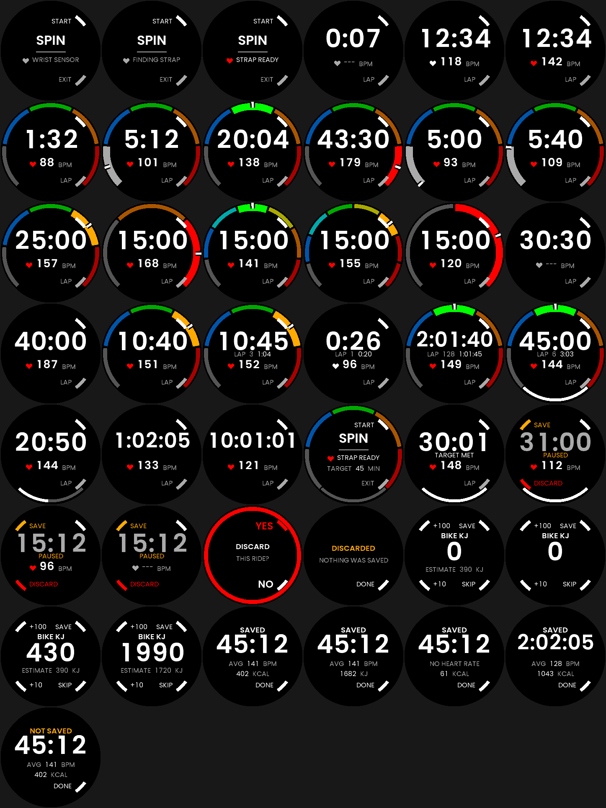
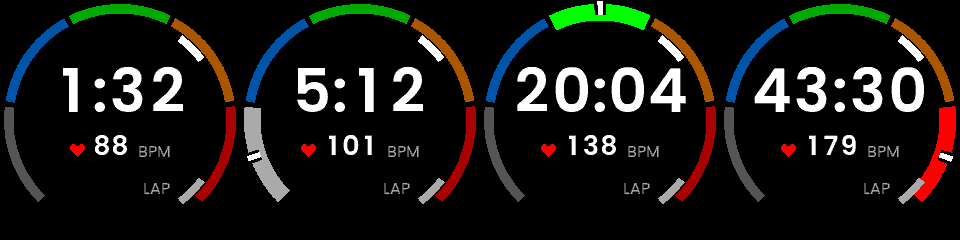
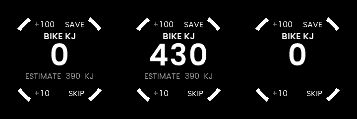
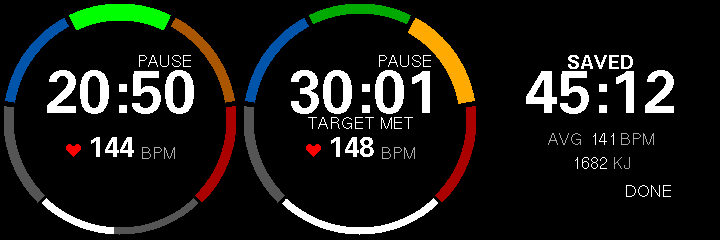
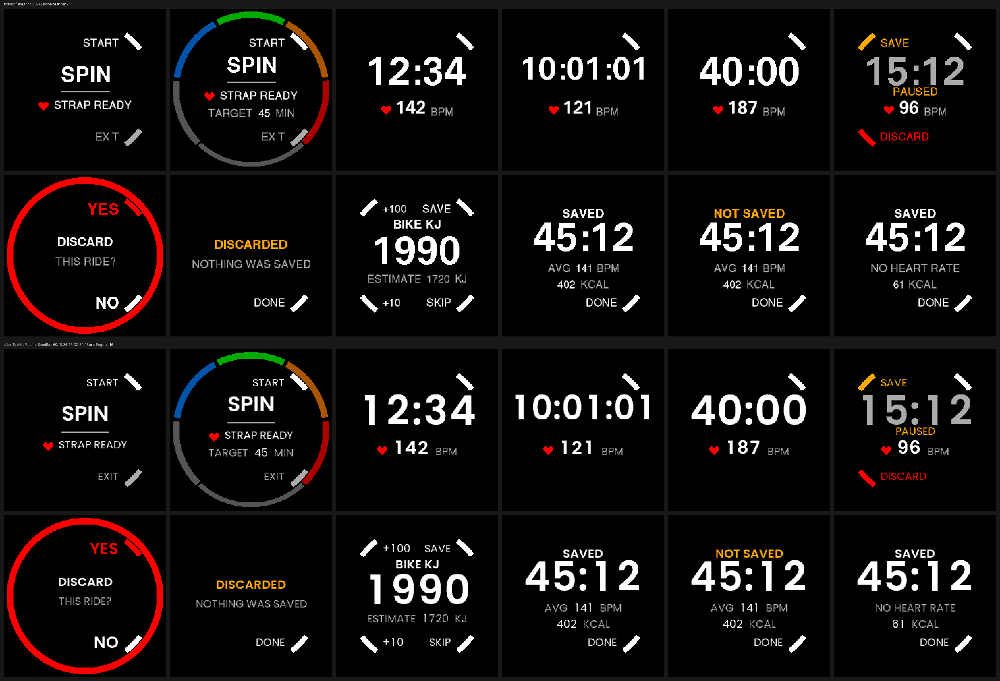
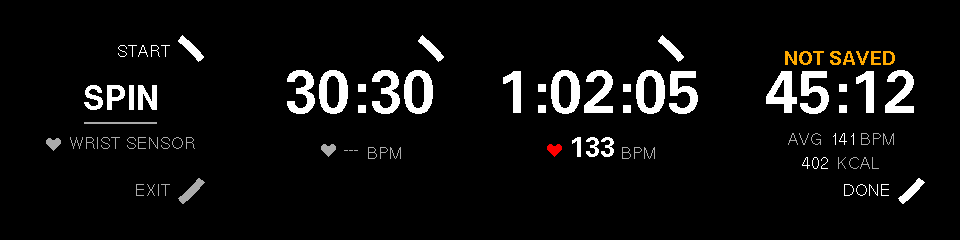
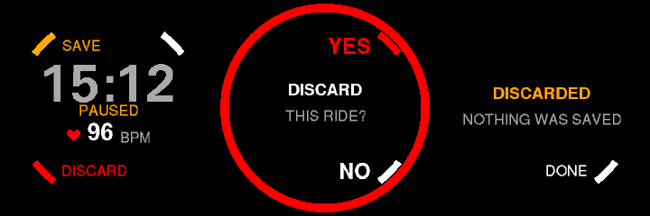

# Spin — a stationary bike ride

A ride that goes nowhere, recorded as a ride that goes nowhere. The clock, your
heart rate and the zone it puts you in, and a FIT file whose `session` says
**`sport = cycling`, `sub_sport = indoor_cycling`**.



The GUI is drawn by **Rust + `embedded-graphics`** through the SDK's
**CustomGUI** entry point, not TouchGFX — the arrangement
[`RustGuiPoc`](../RustGuiPoc/README.md) proved and [`Barcode`](../Barcode/README.md)
ships. Settings come from the phone through **`SDK::AppConfig`**, against the
contract in [`app-manifest.json`](app-manifest.json).

Built against **SDK 1.4.0** (`KERNEL_INTERFACE_VERSION` 3), which is where
`minKernelVersion` comes from — see [Versions](#versions).

## Why the two sport fields are the whole point

Record an indoor ride as plain `sport = cycling` and every consumer downstream
reads it as a bike ride that covered no ground: 45 minutes, 0.0 km, an average
speed of zero, and a place in your distance totals it did not earn. `sub_sport
= indoor_cycling` is the field that says the distance is absent because there
was never any, and it is the difference between a ride Strava files as an
indoor ride and one it files as a broken outdoor one.

Both values come from the SDK's own profile header, which already carries the
pair (`SDK::Fit::Sport::Cycling`, `SDK::Fit::SubSport::IndoorCycling`).

Everything else in the file, all asserted in
[`Tests/ActivityWriter_test.cpp`](Tests/ActivityWriter_test.cpp):

- **At least one lap, and they add up.** Spin has no lap button, so with
  auto-lap off the single lap is the whole ride — a session with no lap at all
  is one many FIT consumers quietly drop. With auto-lap on, the laps sum to the
  session.
- **Where each beat came from.** Every `record` carries the arbitrated
  `heart_rate` plus developer fields `hr_source`, `hr_optical` and
  `hr_external`. Which sensor the kernel believed is not recoverable from the
  arbitrated number afterwards, and on a ride whose point is the strap it is
  the first thing worth checking.
- **Time in each heart-rate zone**, on the session and on every lap, as the
  profile's native `time_in_hr_zone` — in six buckets that account for every
  active second. The two messages do not use the same field number; see
  [below](#time-in-zone-and-the-field-number-that-is-not-shared).
- **Active and resting calories**, as `total_calories` and
  `metabolic_calories`.
- **The work the bike reported**, when the wearer typed it in, as
  `total_work` in joules and the `avg_power` it implies — the two native fields
  that let something downstream work out whether you are getting fitter.
  Absent, not zero, on a ride where nobody said. See
  [below](#the-kilojoules-the-bike-knows).

A `.json` summary lands beside the `.fit`, saying `"activity_type": "cycling"`.
It is auxiliary and best-effort by contract — the FIT file is what
`ActivityWriter::stop()` reports success on — but it is what the watch's own
activity list reads, so it must not disagree about the sport.

## The strap

Spin asks the kernel for an external heart-rate monitor as soon as the app
opens, not when the ride starts, so the BLE link has the pre-ride screen's
worth of time to come up. Readings arrive through the ordinary
`HEART_RATE_EX` sensor either way: the kernel arbitrates strap against wrist
optical and reports which it chose.

The heart on screen is the whole legend, and it is the only red thing in the
app:

| Heart | Means |
|---|---|
| **Red** | the beat on screen came from the chest strap |
| **White** | it came from the wrist sensor |
| **Grey**, with `---` | no reading the watch is willing to stand behind |

That last row is a deliberate third state, but it is not instant. The kernel
reports a 0–3 confidence with every reading, and the **file** drops anything
outside 1–3 — the gap is recorded rather than a beat invented. The **screen**
holds the last trusted reading for up to ten seconds first, because those are
different questions: the file answers "what was measured this second", the
screen answers "what do we believe your heart rate is".

That split came out of the first two rides on real hardware. 5% of seconds were
reported untrusted, and in 31 of 32 of them the sensor still had a reading
within a beat or two of its neighbours — every one lasting one second, or two.
The number was disappearing and coming straight back, several times a minute,
on a signal whose consecutive readings differ by 0.2 bpm on average. There is
no jitter here to filter and [`HrHold`](Software/Libs/Header/HrHold.hpp)
deliberately does not average anything; a held second reports exactly what the
sensor last produced. Past ten seconds it gives up, because a watch off the
wrist must stop showing a heart rate that is no longer anyone's.

**Pairing happens in the watch's own settings, not here.** Spin opts in to
whatever heart-rate monitor the firmware already knows about; it cannot scan
for or bond with a new one, and the same firmware limit is why there is no
cadence or power support — see [What it does not do](#what-it-does-not-do).

## Heart-rate zones



The zones are the rim. A 270-degree scale in the usual ladder — grey, blue,
green, amber, red — with the zone you are in drawn bright **and** thicker,
growing inward while the rest stay thin. Two signals rather than one, because on
a reflective panel in bad light colour alone is thin.

The panel is a circle and this is the one piece of information here that is
naturally a scale, so it gets the perimeter and the middle stays clear for the
numbers. Four levels a channel is the whole palette, so those five colours are
not approximations of nicer ones: they are the colours.

A white needle crosses the ring at your actual heart rate — not just which zone,
but where in it. Without it a 93 and a 109 both light zone 1 and look identical,
and the dial is a guess. Its position comes from the Service, as a fraction
*within* the lit zone rather than along the whole ring: the segments are equal
angular slices with gaps between them, and a position measured across the whole
scale drifts out of its own segment by the fifth one.

It is drawn from the ring's inner edge out to just short of the bezel, with a
black slot beneath it, so it reads against any segment colour — a white marker
sitting entirely inside a grey zone-1 arc would be nearly invisible. Below zone
1 there is no needle: the bottom of zone 1 is a threshold you set, but the scale
itself has no defined bottom, so there is nowhere honest to point.

The zone is a position, not a gauge, so the segments below the current one do
not fill — a filling scale would read as progress through the zones, which is
not a thing that happens. Zone 0, below zone 1, lights nothing at all: the scale
is there, you are not on it yet.

The 90 degrees left open at the bottom is where the **target progress arc**
goes, growing left to right to meet the zone scale where it ends. With no target
set the gap stays empty, which is what keeps it reading as a speedometer rather
than a closed circle.

**Any number of zones from two to eight**, and the dial adapts: the ladder is
written out per count rather than sampled from one palette by formula, so every
size ends grey-to-red and the five-zone one is the familiar
grey/blue/green/amber/red rather than whatever arithmetic produced. Eight is
where the kernel's own threshold table stops, so it is not a limit invented
here.

**By default the zones are the watch's own**, read with
`SDK::Message::RequestSystemSettings` — the same ones every other activity app
uses, and a second copy is a second thing to keep in step. The watch reports its
ladder as 50/60/70/80/90/100% of maximum heart rate, so the last value is the
maximum rather than a floor and Spin drops it to get five floors.

**`hrZoneCount` defaults to 5**, because five is what almost everyone means by
heart-rate zones and it is what the watch itself ships. Set it to anything from
2 to 8 for a model the watch cannot express — a three-zone polarised split, or a
seven- or eight-zone ladder — or to 0 to take however many the watch has.

**The floors can be left alone.** With every `hrZoneNMin` at 0 they are spread
evenly from half the maximum heart rate up to it, which is the watch's own rule:
its ladder is 50/60/70/80/90/100% of maximum. At five zones that reproduces the
watch's floors *exactly*, which is the reason to trust it at three or eight —
it is the same rule at a different count, not a training model invented here.
[`ZoneLadder_test.cpp`](Tests/ZoneLadder_test.cpp) asserts that match, so if it
ever stops holding the argument for the rule goes with it.

Fill the floors in to follow a published model instead. Zone *N* runs from its
own floor up to the next zone's, so eight zones need eight floors rather than
nine.

### Where the intervals close

Each zone is **closed at its floor and open at the top**: zone *N* is
`floor(N) <= hr < floor(N+1)`, so a heart rate exactly on a floor is in the zone
above it, which is what "lowest heart rate in zone *N*" means.

The **top zone is open** — everything at or above the last floor — because that
is what every training model means by it. The **bottom is not**: below zone 1 is
not a zone but a state of its own. Nothing lights on the dial, the needle is not
drawn, and the FIT file records it as bucket `[0]`.

The one place the open top needs a boundary is the needle, which cannot be
placed in an unbounded interval. It — and only it — treats the maximum heart
rate as the top zone's ceiling, and pins above it, because there is no scale
beyond the top of the scale. Membership and time-in-zone stay open.

Floors that are not strictly increasing are ignored and the watch's zones used
instead: a dial whose segments correspond to nothing is worse than one that is
merely not what was asked for, and the ride still has to record either way.

If no zones are set at all, **the dial is not drawn**. "Below zone 1" and "you
have not set any zones" are different states, and an unlit dial would say the
first when it means the second.

The FIT file follows the same count: `time_in_hr_zone` is declared *zones + 1*
long, so a five-zone ride writes six buckets and an eight-zone one writes nine,
and a reader sees exactly the zones that existed rather than a fixed array
padded with zeros it would have to read as time spent nowhere near a zone.

## Calories, and why not kJ

The estimate is the standard heart-rate-zone MET model: each zone carries a
metabolic equivalent, and energy is that times body mass times time. Body mass
comes from the watch's profile (75 kg if it has none, which scales the estimate
rather than breaking it). Below zone 1 — or with no zones set — the resting
rate is the only honest answer, so that is what is used; a MET plucked for
"some effort" would be a guess stacked on a guess. Resting energy accrues every
active second regardless, and is reported separately as
`metabolic_calories` so the two can be told apart afterwards.

It is a model, not calorimetry. It will be wrong for you by some steady factor,
and it is most useful compared against itself ride to ride.

**The watch will never *derive* a kJ-of-work figure.** In cycling, kJ means
mechanical work, which comes from power — and that it lands close to the kcal
you burned is a coincidence of human efficiency being about a quarter. Deriving
kJ from a heart-rate calorie estimate and labelling it kJ would put a number on
screen that a rider would compare against their power meter and find roughly
four times too large, in exactly the unit that invites the comparison. Silent,
familiar and wrong is the worst of the three.

The way to have the number honestly is to **ask** — which is what the screen
[below](#the-kilojoules-the-bike-knows) does. A measurement with a source is a
different thing from a guess wearing the same unit, and the distinction is
load-bearing enough that the entry screen refuses to pre-fill itself with the
guess.

What **is** offered is kJ as a unit for the same dietary energy — 1 kcal =
4.184 kJ, the unit food labels use across much of the world. That is a
relabelling of the estimate, not a different measurement, and the `Energy in
kJ` setting says so. **The FIT file always records kcal**, because that is the
unit `total_calories` is defined in.

## The kilojoules the bike knows



Spin measures **strain** and not **work**, and the gap between those is why
nothing in this app can show you getting fitter. Heart rate alone is confounded
by sleep, heat, caffeine and stress, so "142 bpm again" says nothing about
fitness. Work is the missing half: kJ ÷ duration is average power, and average
power ÷ average heart rate is Efficiency Factor — which rising at a constant
heart rate is precisely what getting fitter looks like.

The watch cannot measure work. The bike in front of you already has. So when a
ride ends, before the file is written, the screen asks for the number on the
console.

**The analysis is not on the watch, and must not be.** `total_work` and
`avg_power` are native FIT fields and the manifest already sets
`stravaExport: true`, so Intervals.icu and TrainingPeaks compute the trend for
free once the numbers are in the file. A training log on a 240×240 panel would
be a worse version of a thing that already exists.

### Two buttons, two places, no mode

Four buttons, `CLICK` only, no auto-repeat, no touch — and two of the four are
spoken for on every screen in this app (R1 acts, R2 leaves). So the number gets
exactly two: **L1 advances the hundreds, L2 advances the tens.** Each wraps
within itself and carries nothing, so a click always moves the value by exactly
the amount printed on the button, and overshooting one place never disturbs the
other.

The alternatives were measured rather than argued. Over 200,000 simulated
sessions (25–90 min at 70–280 W, median 490 kJ), clicks to enter the value:

| scheme | mean | p50 | p95 | max |
|---|---:|---:|---:|---:|
| **two places, +100 / +10** | **9.2** | **9** | **15** | **22** |
| one adder + a 100↔10 step toggle | 10.2 | 10 | 16 | 23 |
| one adder + a 100/10/1 step cycle | 10.2 | 10 | 16 | 23 |
| increment + a digit cursor | 10.2 | 10 | 16 | 23 |

Every scheme that needs a mode pays exactly the one click it spends changing
the mode — and then still has the mode, for a wearer to track while out of
breath. So the mode buys nothing and is not there.

**The step is 10 kJ.** A third place costs 6.4 clicks on average (9.2 → 15.6)
and buys ±5 kJ, which on a 45-minute ride is ±1.85 W. That is inside the
console's own accuracy, and it is unbiased — rounding to the nearest ten is as
often high as low, so it adds noise to one ride and shifts no trend.

**The hundreds run to 19, not 9.** Stopping at 990 kJ would make 2.3% of those
sessions unenterable, and a two-hour trainer ride at 200 W is 1440 kJ. Reaching
1990 costs nothing on a typical ride, because the cost is the hundreds digit and
that digit is under 10 for a typical ride.

The labels are formatted from the same constants the buttons add, so `+100` and
the arithmetic cannot drift apart. [`work.rs`](Software/Apps/CustomGUI/rust/src/work.rs)
owns both, and its tests are what hold the promise.

### Nothing is pre-filled, and that is the whole point

The obvious seed is the app's own calorie estimate, which for cycling lands
within about 10% of the work in kJ. **It is the wrong thing to put in the
field.** `total_work` carries no "estimated" flag, so a wearer who pressed SAVE
on an unedited seed would write a heart-rate-derived number into the one field
whose purpose is to be independent of heart rate — and Efficiency Factor
computed from it would be a fixed function of the calorie model rather than a
measurement, flat no matter how fit anyone got. Half a season of console
numbers mixed with half a season of seeds is worse than either alone.

So the estimate is shown *beside* the field and never in it: dim, labelled
`ESTIMATE`, doing the one job it is honest at — catching an entry that is off by
a factor of ten. Every digit that reaches the file was put there by the wearer.

### Skipping is a normal ride, not an escape hatch

Most rides will not have a number entered. The wearer may not care, may be in a
hurry, or may be on a bike with no console. **SKIP is one labelled click, drawn
as brightly as SAVE**, and the ride it produces records exactly what this app
recorded before the screen existed — same fields, same values, same durability
contract, same `RideSaved`, same SAVED screen. (Not byte-identical: the session
definition moved later in the stream, for the reason below. Nothing a reader
sees changed.)

And the file **omits both fields entirely** rather than writing zeros. Zero is a
*measurement* meaning the wearer pedalled and produced nothing; absent means
nobody said. Any platform downstream would average a zero into your season. The
fields are left out of the session's message *definition*, not merely written as
an invalid sentinel — a declared field is absent only to a decoder that honours
sentinels, and this is the one place in the app with no way to check what read
the file. That is also why the session definition is emitted in `stop()` rather
than beside the others in `start()`: whether the ride has a work figure is not
known until it ends.

`askForKilojoules` turns the question off for a bike that has no console. It
defaults to **on**, because a screen nobody knows to enable is a feature nobody
has.

### It rides on `TRACK_STOP`

The FIT file is finalised when the Service handles `TRACK_STOP`, so the question
comes *before* that message and the answer travels on it. Writing the file and
then reopening it to amend it would put two things at risk for nothing: the
durability contract `ActivityWriter::stop()` reports — which the SAVED screen
repeats to the wearer as a fact about the filesystem — and the crash-recovery
marker that is dropped on the strength of it. The ride ending stays one atomic
event.

A crash-recovered ride therefore has no work figure, because no screen ever ran.
That is fine, and it has to stay fine: absent work is a normal state.

### The field numbers, and the trap they share

Neither field is in `SDK/Fit/FitProfile.hpp`, so both numbers came from the FIT
profile itself via [`Tools/fit-profile`](../Tools/fit-profile). And they spring
exactly the trap `time_in_hr_zone` already sprang here — worse, because every
wrong number lands somewhere plausible:

| Meant | Right | Wrong | What actually lives there |
|---|---:|---:|---|
| `session.total_work` | **48** | 41 | `avg_stroke_count`, uint32, strokes/lap |
| `session.avg_power` | **20** | 19 | `max_cadence`, uint8, rpm |
| `lap.avg_power` | 19 | 20 | `max_power` — the average, reported as the maximum |

Spin measures no strokes and no cadence, so nothing would look wrong from the
writing end. `ActivityWriter_test.cpp` asserts the session wrote nothing into
41, 19 or 21, and the numbers themselves decode correctly under
**python-fitparse**, which shares no code with the writer or with the SDK's test
reader.

**`total_work` is in joules**, not kilojoules. The wearer enters kJ; the file
holds a thousand times that.

### What is deliberately not written

- **No per-record power stream.** Tempting, because it would make Strava draw a
  power graph — but a constant stream makes normalized power ≈ average power,
  and every platform downstream then computes a confidently wrong TSS from it.
  Session totals only.
- **No `training_stress_score` or `intensity_factor`.** Both need a real FTP.
  Derived from a fake NP they are precision-shaped garbage.
- **Nothing in `total_training_effect`.** That field is Firstbeat's 0–5 aerobic
  TE and means something specific.
- **Nothing on the lap.** One number covers the whole ride and cannot be
  honestly divided between auto-lap splits; apportioning it by time would be
  inventing a distribution, which is the per-record argument one level up.

## What the phone shows

`customMeasures` in [`app-manifest.json`](app-manifest.json) is the mechanism by
which anything beyond the standard metrics appears in the UNA phone app after an
activity. It is a manifest concept and not a FIT one — the display layer,
independent of whether the number underneath is a native field or a developer
field.

It had been `[]` since the first release, which meant the four developer fields
this app has always written (`resting_calories`, `hr_source`, `hr_optical`,
`hr_external`) were **invisible on the phone**. They are declared now, along
with the two new ones:

| Measure | Unit | Shown as |
|---|---|---|
| `total_work` | kJ | a number, in the preview |
| `avg_power` | W | a number, in the preview |
| `resting_calories` | kcal | a number |
| `hr_source` | — | a line chart |
| `hr_optical` | bpm | a line chart |
| `hr_external` | bpm | a line chart |

Every entry names the app's own `icon.png`: Spin ships one icon, and the packer
does no icon processing at all today, so a path to per-measure art nobody has
drawn would be a promise the repository could not keep.

## Settings

Written by the phone into the app's own directory as `app_config.json`, read
through `SDK::AppConfig`, and declared in
[`app-manifest.json`](app-manifest.json). Re-read at the start of every ride, so
a change takes effect on the next ride rather than the next reinstall.

| Setting | Default | Does |
|---|---|---|
| `autoLapMinutes` | 0 (off) | Split the ride into laps this many minutes apart, with a buzz at each. Measured on active time, so a paused ride does not come back to an immediate lap. |
| `targetMinutes` | 0 (off) | Buzz once at this many minutes and say `TARGET MET` on the screen. |
| `keepScreenLit` | off | Hold the backlight on for the whole ride. |
| `energyInKilojoules` | off | Show energy as kJ instead of kcal. Display only. |
| `askForKilojoules` | **on** | Ask for the bike console's kJ when a ride ends, and record them as work and average power. |
| `hrZoneCount` | 5 | How many zones, 2 to 8. 0 takes the watch's count. |
| `hrZone1Min` … `hrZone8Min` | 0 | The bpm floor of each zone. All 0 spreads them over the watch's own range. |



`askForKilojoules` is the one default that is on rather than off. The screen it
controls is the only way this app can learn what work a ride did, so hiding it
behind a setting nobody knows to enable would be hiding the feature — and it
costs a wearer who does not want it exactly one labelled click to skip. Off is
for the bike with no console, where the question can never be answered.

Both integer settings use 0 as "off" rather than carrying a separate toggle:
there is no useful reading of "auto-lap every 0 minutes", so the value can
carry the switch and the form stays four rows.

`keepScreenLit` exists because of a real problem rather than for completeness:
with your hands on the bars the wrist-tilt gesture almost never fires, so in a
dark room the clock is unreadable for the whole ride. It is off by default
because the panel is reflective and a lit gym needs no front light, so most of
the time it would cost battery for nothing.

The two buzzes are deliberately different — two short beeps for a lap, three
longer ones for the target. A lap is a marker you can ignore; the target is the
thing you were riding for, and they have to be tellable apart without looking
down.

**The binary carries its own copy of the contract**, in
[`AppConfigFields.cpp`](Software/Libs/Sources/AppConfigFields.cpp), because
`app-manifest.json` never reaches the watch. CI checks the two agree
(`validate_app_config.py --check-bounds`), which is what makes it safe for
`SDK::AppConfig` to clamp a value it should never have received.

## Screens and buttons

R1 is the primary action on every screen, so it is the only button you have to
find from the saddle. R2 leaves — but never while the clock is running, where
an accidental exit would cost the ride.

| Screen | Shows | L1 | L2 | R1 | R2 |
|---|---|---|---|---|---|
| Ready | strap status, target if set | | | **START** | **EXIT** |
| Riding | clock, heart rate, zone | | | pause | |
| Paused | dimmed clock, `PAUSED` | **SAVE** | **DISCARD** | resume | |
| Bike kJ | the number being built | **+100** | **+10** | **SAVE** | **SKIP** |
| Saved / discarded | what happened | | | done | **DONE** |

The kJ screen is the only one where all four buttons are live, and it is why
`SAVE` on the paused screen no longer stops the ride outright: it asks first.
Every other route to a stopped ride — skipping, discarding, the system
force-stopping the app — reaches the file with no work figure, which is a
perfectly normal ride.

Each live button is marked by a short arc at its own corner of the bezel — the
same mark the SDK's TouchGFX apps use, and it belongs to the zone ring's family
rather than floating free. **Words appear only where there is a decision.**
While riding there is one live button and one obvious thing for it to do, so it
gets the mark alone; the same goes for resume when paused, which was PAUSE a
second earlier. The two endings of a ride get words, because choosing between
them is the whole reason that screen exists.

The first version put the labels on horizontal rows above and below the clock,
where `PAUSE` landed directly over it and read as its caption, and `FINISH` and
`RESUME` read as a title bar. Hints belong on the diagonals, because that is
where the buttons are.

The two endings of a ride sit at opposite corners on purpose. Finish is the
button you reach for every time; discard destroys the ride, and it should not be
the neighbour of the one you press without looking.

The clock picks the largest of three sizes that fits, so `12:34` gets the big
one and `10:00:00` is not clipped, and it drops to `M:SS` under an hour rather
than padding an hour field nobody is riding into.

## Text

Every word and digit is Poppins, pre-rendered at build time into 2bpp atlases
by [`TextKit`](../TextKit) and blitted through the bezel: SemiBold 60, 49 and
36 for the clock's three sizes, SemiBold 27 for the heart rate, SemiBold 32
for `SPIN`, 24 for the discard answers and 18 for headings, and Regular 16
with Latin-1 and Latin Extended-A for every label. The clock and title faces
carry only the characters they draw (thirteen glyphs a clock size, five for
the title), so seven sizes cost 25 KB of glyph data in all. Before and after
the port, through the bezel mask the preview applies:



The first Rust build drew from u8g2's 1bpp Helvetica faces one size class
up and area-averaged them down to the panel's four levels, through a
26,880-byte scratch buffer sized by hand from the widest string. That was a
stand-in for anti-aliasing rather than the thing itself: at 54 px the source
had 63 rows, so the digits were nearly hard-edged, and the widths were the
source face's scaled by a height ratio. The atlases are the glyphs TouchGFX
Designer would have produced for the same faces, pixel for pixel, with real
metrics, and no scratch buffer at all; the GUI is 19 KB smaller in RAM and
7 KB larger on disk for it. The screens ask for text by the heights the old
build used, and each height names the Poppins face whose capital height
matches, so no layout constant moved. Why atlases rather than a runtime
rasterizer is measured in [`Docs/TEXT.md`](../Docs/TEXT.md).

Footprint of the GUI, from CI's toolchain image:

```
TextKit  .text 44,804   .bss 58,320   .stack 10,240   .uapp 121,060
u8g2     .text 36,984   .bss 85,200   .stack 10,240   .uapp 113,612
```

Edge cases, all of them scenes in the preview binary — no strap, a mid-ride
dropout, past the hour, and a save that failed:



`NOT SAVED` is not a hedge. `ActivityWriter::stop()` returns true only once the
`.fit` is flushed and closed, and that boolean is what the screen reports — so
"SAVED" is a fact about the filesystem, and its absence is worth an amber word.

## Throwing a ride away



`DISCARD` on the paused screen asks first, on a screen of its own, with both
answers on buttons: **R1 yes, R2 no**. Two deliberate presses on two screens,
because this is the one action in the app that destroys data.

**It is not a press-and-hold, and that is the second design.** The first one
was, matching the SDK's own activity apps — and on the watch it never fired
once. Spin turns on the music-control overlay in `setCapabilities()`, the system
claims the long press to open it, and `HOLD_1S` never reached the app. The SDK's
own port notes say `LONG_PRESS` and `HOLD_*` are not forwarded to screens
anyway.

Worse than not working: the screen it stranded the wearer on could only be left
by that same event, so there was no way out of it at all. Two ordinary clicks
are intercepted by nothing, and the way back is a labelled button. Suspending
the GUI also leaves the screen — a question you walked away from is not one you
answered.

`ActivityWriter::discard()` removes the part-written `.fit` **and the recovery
marker with it**, so the next boot does not finalise a ride that was
deliberately thrown away. There is a test for exactly that.

`DISCARDED` is not the same screen as `NOT SAVED`. One is what the wearer asked
for and the other is a failure, and the screen should agree with them rather
than apologise for something they chose.

## How the two halves fit together

A GUI process cannot reach a sensor: `SDK/Kernel/Kernel.hpp` defines what a GUI
process is handed and `SDK::Sensor::Connection` is not in it. So the clock, the
heart rate, the zones, the energy and the file all live in the Service, and the
GUI draws snapshots:

```
HEART_RATE_EX ─┐
   the clock ──┤→ Service.cpp ──CustomMessage──→ Gui.cpp ──spin_gui_frame──→ lib.rs
 app_config ───┤                                                             (pixels)
               └→ ActivityWriter → .fit
```

Three properties that arrangement buys:

- **The GUI owns no timer.** The number on the screen and the number in the FIT
  file are the same measurement of the same second, not two counters that agree
  until one of them drifts.
- **The Service owns every derived fact**, including whether the target has
  been passed. The screen shows the same flag that fired the buzz, so it can
  never announce the target a second before or after the wrist felt it.
- **`render()` is a pure function of one `Frame`.** The watch, the host preview
  and the unit tests all call it the same way, so a screenshot taken on a
  laptop is evidence about the watch.

The C↔Rust struct is checked in both directions: `spin_gui.h` and `lib.rs` each
compute an FNV-1a fingerprint over the layout their own compiler produced, and
`Gui::run()` refuses to start if they disagree. A stale `libspin_gui.a` linked
against a changed struct is otherwise silent until it draws garbage.

## Time in zone, and the field number that is not shared

`time_in_hr_zone` is not in `SDK/Fit/FitProfile.hpp`, which carries only the
fields UNA's own apps write, so its number had to come from the FIT profile
itself. It is worth spelling out what that lookup found, because the obvious
assumption is wrong:

| Message | `time_in_hr_zone` |
|---|---|
| `lap` | field **57** |
| `session` | field **65** |

**Session field 57 is `avg_temperature`** — a `sint8` in degrees Celsius. Using
the lap number on the session would have declared a temperature field as a
six-element `uint32` array and had every decoder report nonsense for it,
silently, in every file this app ever wrote. The app measures no temperature, so
nothing would have looked wrong from here.

Both numbers were checked against the Garmin FIT SDK profile (21.214.0Release)
and against python-fitparse's independently generated copy, which agree. The
scale is 1000, so the file holds milliseconds and
`ActivityWriter::writeZoneSeconds()` multiplies on the way in.

**Lap resting calories stays a developer field**, and now for a checked reason
rather than a cautious one: the FIT profile has no `lap.resting_calories`. `lap`
has `total_calories` (11) and `total_fat_calories` (12) and nothing else in the
family, so there is nothing to promote it to. Its sibling on the session,
`metabolic_calories` (196), does exist and is used natively.

A developer field is self-describing — it carries its own name, units and base
type in the file — which is what makes it a safe home for a quantity the
profile has no slot for.

## What it does not do

Deliberately, and the first two are firmware limits rather than choices:

- **No cadence, and no *measured* power.** Both need a BLE sensor the watch
  would have to pair with itself, and an app can only opt in to accessory kinds
  the firmware supports. Today that is heart rate. The `avg_power` in the file
  is arithmetic on a number the wearer read off the bike, not something this
  watch measured — which is why it is a session total and never a per-second
  series. See [the kilojoules the bike knows](#the-kilojoules-the-bike-knows).
- **No broadcasting heart rate** to a trainer or to Zwift, for the same reason:
  that needs the BLE peripheral role.
- **No distance or speed.** There is no honest way to produce either without a
  trainer, and a fabricated distance is worse than an absent one. The FIT file
  omits both rather than writing zeros.
- **No structured intervals.** Reachable with what is already here — the SDK's
  profile even carries `Workout` and `WorkoutStep` — and the obvious next thing
  to build.

## Versions

Spin is built against **SDK 1.4.0**, whose `KERNEL_INTERFACE_VERSION` is 3. An
app carries the interface version it was built against, and the on-device check
in `AppSystem/system.cpp` refuses to launch when the running kernel's version is
*lower* — so building against a newer SDK than the watch's firmware produces an
app that packs identically and simply does not run.

`minKernelVersion` in the manifest is the floor that ABI implies, which
`min_kernel_version.py` derives from the SDK's own header. CI checks it on every
build, so the manifest cannot drift from the SDK the binary was actually
compiled against.

## Building

Needs `$UNA_SDK` pointing at an `apps-v1.4.0` checkout, and `cargo` with the
`thumbv8m.main-none-eabihf` target installed:

```sh
rustup target add thumbv8m.main-none-eabihf
export UNA_SDK=/path/to/una-sdk-apps-v1.4.0
cd Spin/Software/Apps/Spin-CMake
cmake -B build -G "Unix Makefiles" -DBUILD_VERSION=0.1.0 . && cmake --build build
```

CMake always invokes cargo and lets it decide whether to rebuild, rather than
restating cargo's own inputs in an `OUTPUT`/`DEPENDS` rule — anything such a
rule missed would silently link a stale archive against a changed ABI. See
[`RustGuiPoc/Docs/FINDINGS.md`](../RustGuiPoc/Docs/FINDINGS.md), "Let cargo
decide when to rebuild".

CI builds it exactly the way it builds `Barcode`: one caller
([`spin.yml`](../.github/workflows/spin.yml)) naming the directory, and the
shared [`app-build.yml`](../.github/workflows/app-build.yml) discovering the
rest — the manifest, the field table, the host tests, the Rust crate and the
CMake project — from what the directory holds.

## Tests

Two suites, because they cover two different things.

**What gets written** — [`Tests/`](Tests), host C++. Encodes a whole ride with
the real `ActivityWriter` against the SDK's in-memory filesystem and decodes it
again with the SDK's independent test FIT reader, then asserts the sport pair,
the CRC, the laps, the per-record heart-rate fields, time-in-zone and the
calorie fields:

```sh
export UNA_SDK=/path/to/una-sdk
cmake -B build-tests -S Spin/Tests && cmake --build build-tests
ctest --test-dir build-tests --output-on-failure
```

**What gets drawn** — Rust unit tests inside the crate, next to the code they
cover. `--features std` is required: the crate is `no_std` for the watch, and a
test binary cannot link a crate whose panics do not unwind.

```sh
cd Spin/Software/Apps/CustomGUI/rust
cargo test --features std
```

Among them, `nothing_is_drawn_outside_the_bezel` renders every scene and
asserts no lit pixel falls outside the circle. The panel is round and the
framebuffer is square, so a label inset from the buffer's edge rather than the
glass's looks fine in a square simulator and loses its last glyph on the watch
— which is exactly what the first version of the button hints did.

## Looking at it

`preview` writes one PNG per scene and needs nothing but a PNG encoder, so it
runs anywhere, including a machine with no SDL2 — the screenshots above came
out of it. It blacks out everything outside the round bezel, which the device
simulator does not.

```sh
cd Spin/Software/Apps/CustomGUI/rust
cargo run --features preview --bin preview -- /tmp/spin      # PNGs
cargo run --features sim --bin sim                           # a window; TAB cycles
```

The scene list lives in [`src/scenes.rs`](Software/Apps/CustomGUI/rust/src/scenes.rs)
and is shared by both binaries and the tests, so "every screen still draws" is
checked against the same list a human reviews.

## The icons

Two of them, with different rules, both drawn by script rather than committed
as art nobody can regenerate:


- [`make_icon.py`](Resources/make_icon.py) draws the watch icon at 30 and 60 px:
  a spin bike in side view, in the SDK's own two tones — teal for the subject,
  grey for the apparatus, the same split the SDK's Cycling icon uses. Both
  survive the panel's truncation exactly, teal landing on `(0,170,170)` and
  grey on white, so nothing dithers.

  The two tones are what make it legible small. The frame crosses in front of
  the flywheel, and separating them by colour costs no pixels where separating
  them by geometry would cost several. The script also quantises its own output
  rather than leaving it to the ABGR2222 converter: an antialiased edge on a
  four-level alpha channel becomes a dashed line, which is why the previous icon
  carried 335 distinct pixel values and speckled on the glass. This one carries
  nine, and 30 px differs from 60 px only by dropping the belt.

  **What makes it a spin bike is the crank**, its own circle at the bottom
  bracket, level with the flywheel and driven by a belt. An earlier version put
  the crank at the flywheel's hub and grew the handlebars out of the wheel,
  which is a penny-farthing — and it shipped that way for several releases. The
  flywheel is low and forward, the frame reaches the floor at both ends, and the
  bars turn up at the front.
- [`make_store_icon.py`](Resources/make_store_icon.py) draws the 512 px icon the
  phone shows. None of the watch's constraints apply, so it gets the round
  panel, the flywheel and the app's one red heart.
